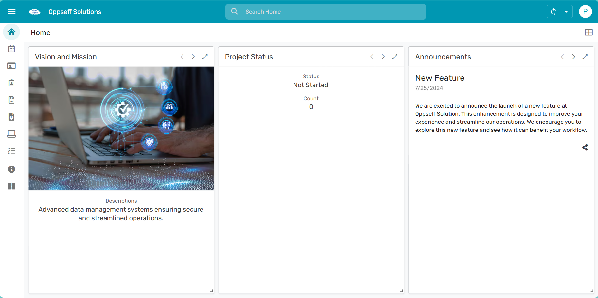
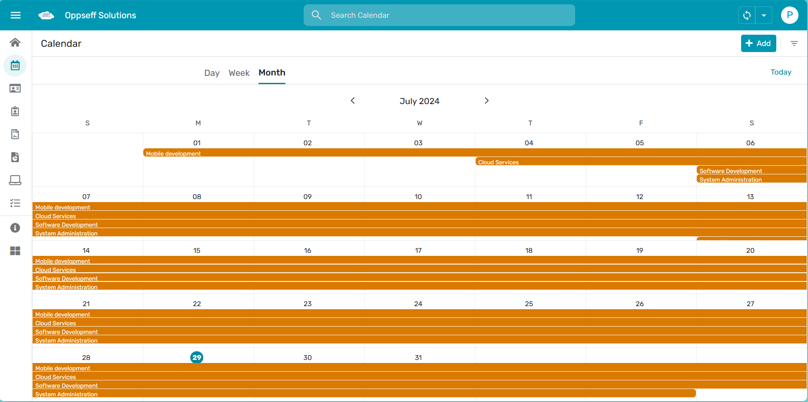
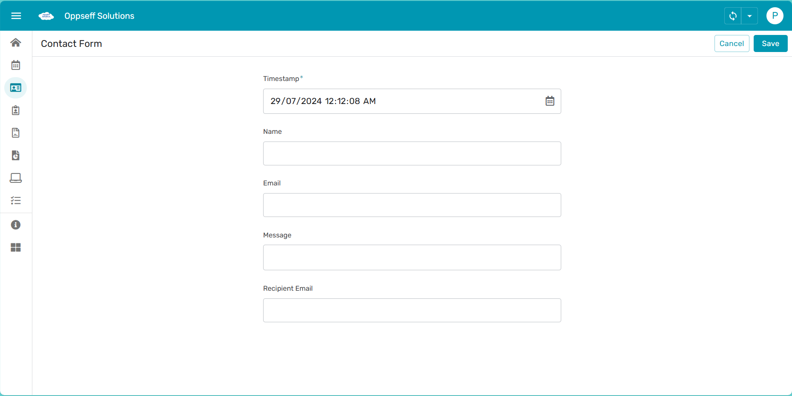
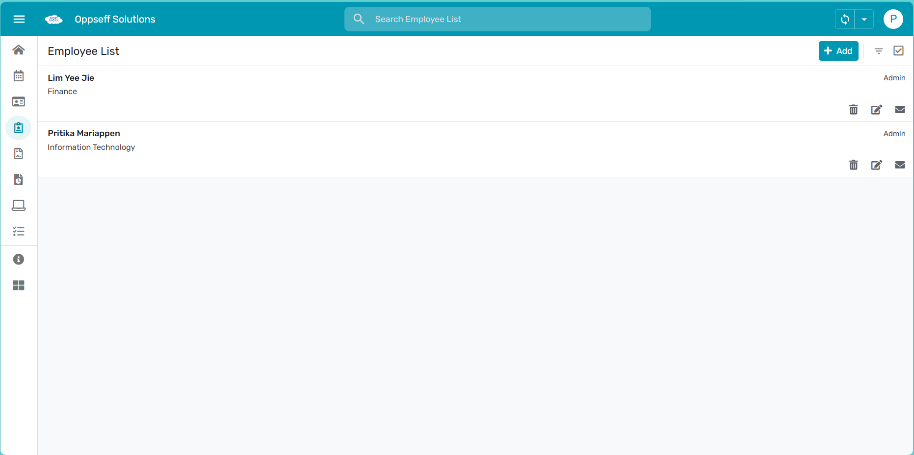
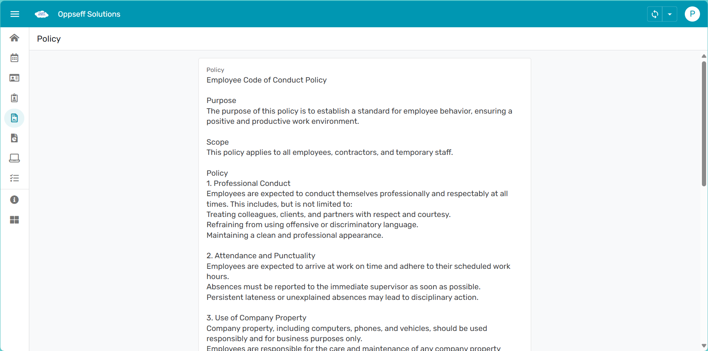
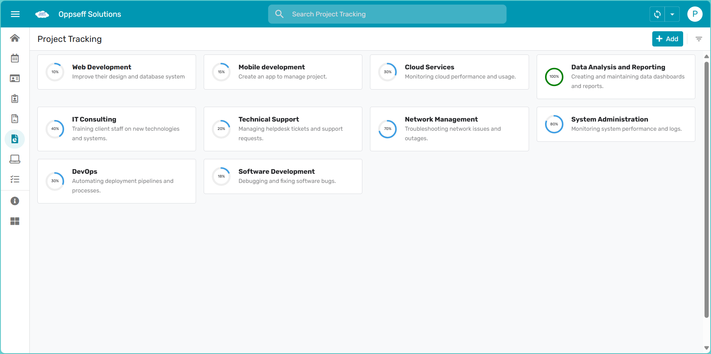
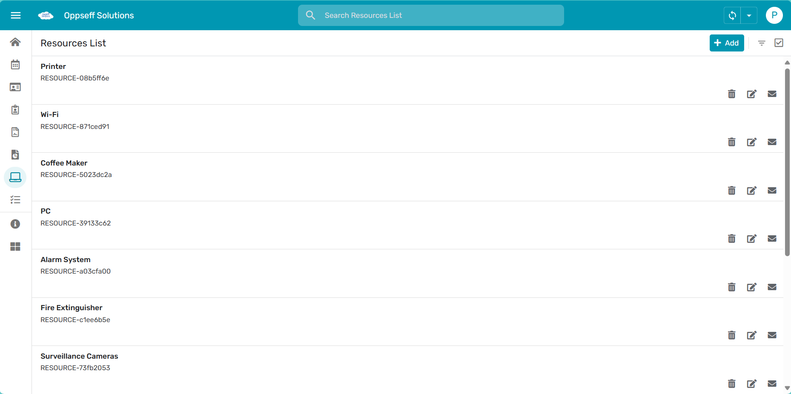
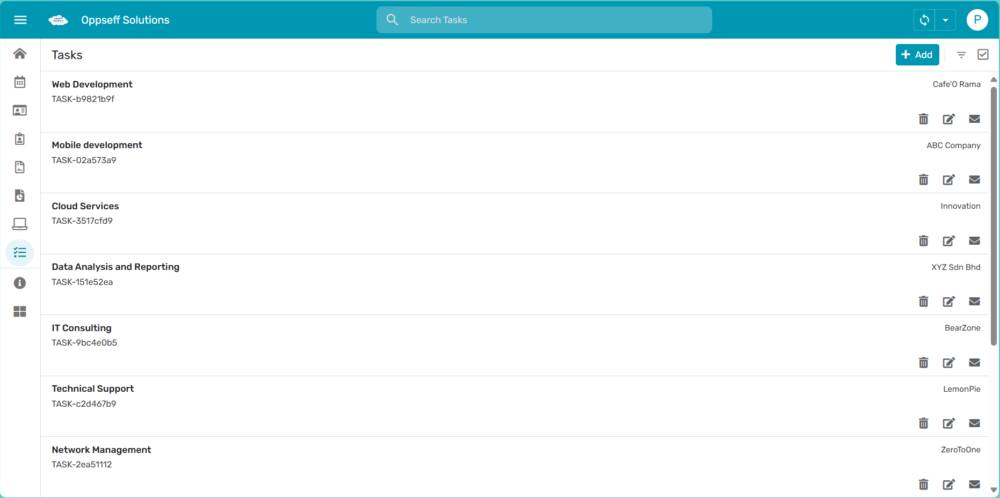
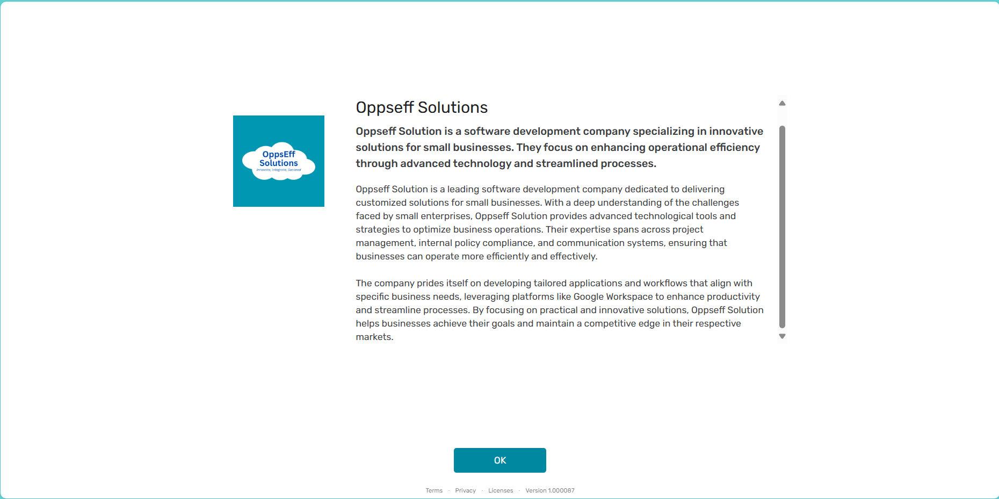

# Oppseff-Solution-Task-Management-App
This repository contains the AppScript code, Google Sheets data, and documentation for Oppseff Solution's Task Management App created using AppSheet. The app streamlines task allocation, resource optimization, project reporting, policy documentation, and internal communication for small businesses.

## AppSheet App
The AppSheet app provides various views for task management, resource tracking, project reporting, and more.

### Screenshots
- **Home View**
  
- **Calendar View**
  
- **Contact Form View**
  
- **Employee List View** (Restricted)
  
- **Policy View**
  
- **Project Tracking View**
  
- **Resource List View**
  
- **Task Lists View**
  
- **About View**
  

### Accessing the AppSheet App
[Click here to access the AppSheet app](https://www.appsheet.com/start/b4f3168b-b19c-405f-b693-df3fe4410ef0?platform=desktop#vss=H4sIAAAAAAAAA52PTW_CMAyG_4vPAfWD8ZErTAKhcRiIwwgHQ1ytom2qJgxQlf8-Z4DYcexmv34fv3YLXzmdlg73B5Cb9tHN6QISWgWrS00KpIKxqVxjCgVCwQLLqzg1ofDgt-LOOrIg27-j8v-pAnJNlcuznJqwJ1DM3xgeB4KF4AcvoDw63BX0c2Tw34y_XQLejXHcabSfO4ONZmmCDhkqa9aTKOl1okEnGa7iRKYjGY-6_ShOo5f0A7znlMzsj5b0mp968hk7q17PNVb6zWi-KMPCkv8GnAv7MaMBAAA=&view=Home&appName=TaskManagement-968136651-24-07-02)

Please note that certain views and actions are restricted to company employees and are not accessible in the public version of the app. These include:
- Employee List View
- Feedback View
- Task Addition Form
- Resource Addition Form

### Requesting Access to Restricted Views
If you need access to the restricted views for review purposes, please follow these steps:
1. Send an email to piopreety2807@gmail.com with the subject "Access Request for Task Management App".
2. Include your name, organization, and the purpose of your request in the email.
3. You will receive an invitation to access the restricted views within 24 hours.

## AppScript Code
The AppScript code used for automation within the AppSheet app can be found in the `AppScript` directory.

## Google Sheets
The data for this app is stored in Google Sheets. You can access the Google Sheets document [here](https://docs.google.com/spreadsheets/d/1HJCeNhhy0yVNIV4AZdlL8dA5L5X9goY5sI3GDuslvx8/edit?usp=sharing).

## Automated Email Reports
The system automatically sends out the following reports via email:
- Project Report
- Weekly Report
- Resource Utilization Report
- Task Reminder Emails
- Messages Sent Emails

## Contact
For more information, please reach out to us at piopreety2807@gmail.com or yeejie13@gmail.com.
